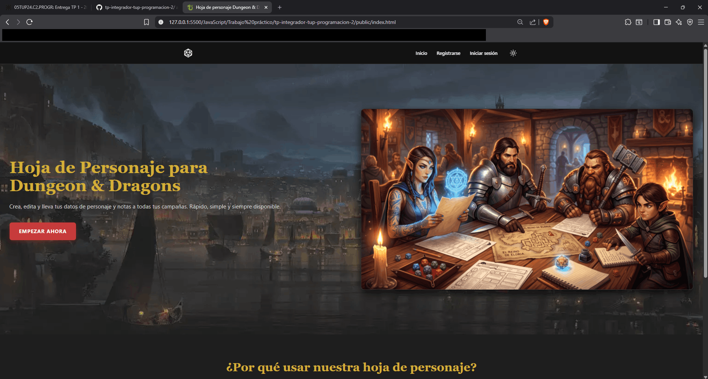
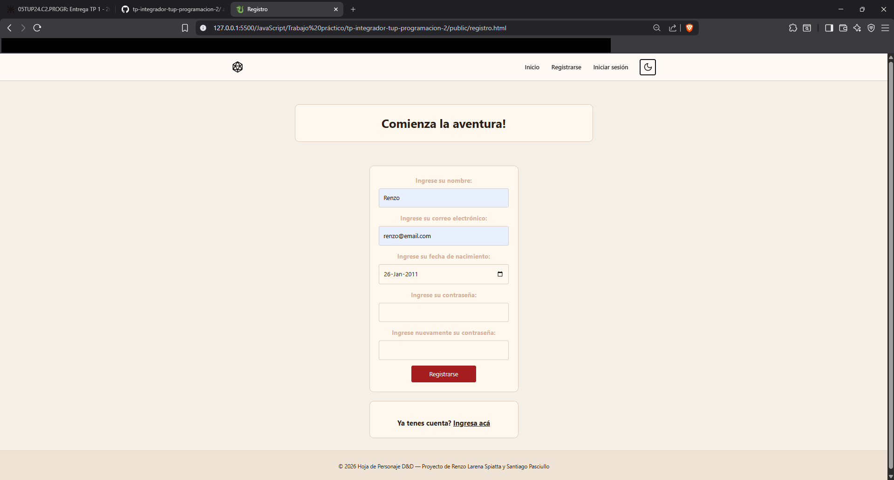
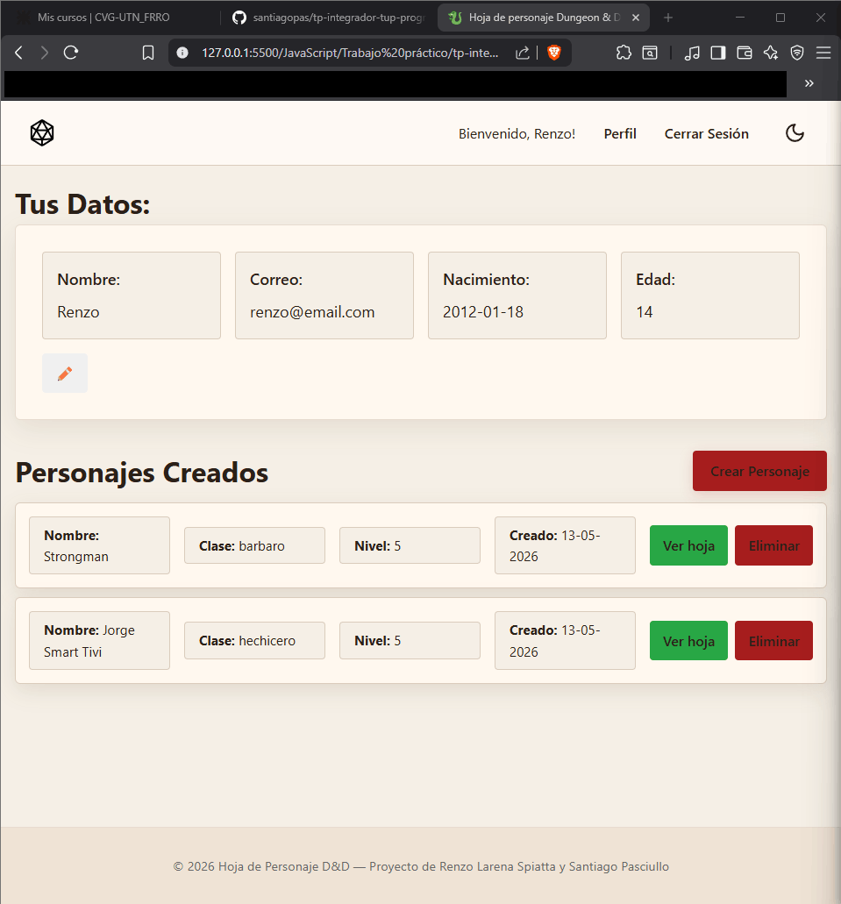
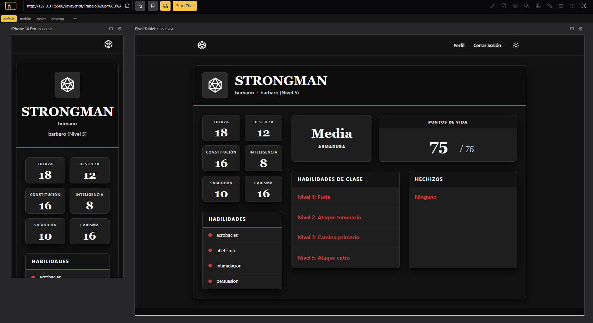

# Tecnicatura Universitaria en Programación

## Programación II — Trabajo Práctico

**Integrantes:**

- Pasciullo, Santiago
- Larena Spiatta, Renzo

### Introducción

El trabajo práctico busca integrar conocimientos de frontend aplicando buenas prácticas y tecnologías modernas. Los estudiantes deberán desarrollar en equipo una aplicación web funcional, responsive y accesible, con persistencia simulada mediante localStorage.

Lo que nos propusimos hacer fue un sitio web que te permita crear un usuario y generar, organizar y eliminar hojas de personajes para el juego de mesa Calabozos y Dragones (Dungeons and Dragons).

---

### Descripción del Proyecto

Utilizamos GitHub y Git para ejecutar el proyecto y organizarnos entre los integrantes. La base de datos que contiene los datos de la cuenta se simula con localSorage.
Se comienza desde la página Index.html, donde se ofrece una introducción de la pagina y el funcionamiento general de la página web. De ahí se puede acceder a las páginas de registro e inicio de sesión, donde se puede registrar con un usuario si no tiene cuenta, o “loguearse” con una cuenta actual si ya la tiene.
Al iniciar sesión, se accede a la página con la cuenta del usuario, donde se muestran los datos personales y se permite editarlos. Como un usuario nuevo no tiene personajes hechos, la primera vez que se ingresa no existen personajes creados, por lo que se continua con la creación de un personaje.
En la página de creación de personaje, se gestiona las características básicas de un personaje ficticio que el usuario puede crear para utilizar en el juego de mesa; se elige una o varias de las opciones presentadas, y si el usuario esta conforme, se continua con el botón de crear personaje, o la opción de limpiar todos los campos para empezar de cero. Si se decide continuar, se avanza automáticamente a la siguiente página.
La hoja de personaje muestra y permite editar algunos datos del personaje ingresado, listo para utilizar en el juego de mesa.
Si se vuelve al perfil del usuario, de ahora en adelante aparecerán en pantalla los personajes creados, y si se desea puede eliminar personajes que ya no quiera utilizar, asi como crear más personajes.

---

### Instrucciones de ejecución

Se puede acceder a las páginas mediante el siguiente link:
<https://tp-integrador-tup-programacion-2.vercel.app/>
No hay necesidad de correr el programa localmente, pero de ser necesario, se puede levanter utilizando live server desde el archivo index.html.

---

### Funcionalidades implementadas

1. Inicio de sesión
2. Registro de usuario
3. Gestión de datos del usuario
4. Gestión de personajes

### Funcionalidades extras implementadas

1. Modo claro/oscuro
2. Animación de imágenes

---

### Tecnologías

Después, de cada tecnología utilizamos:

HTML5:

- Uso de estructuras semánticas (header, nav, main, etc.) y metadatos (meta charset, viewport, description, keywords, author),
- Implementación de favicon y manifest para compatibilidad con dispositivos móviles,
- Enlaces a hojas de estilo externas y scripts con defer para optimizar carga de datos,
- Navegación accesible con botones y enlaces

CSS:

- Flexbox y Grid para maquetación adaptable,
- Uso de variables para consistencia en colores, estilos, e interacciones,
- Sombras, bordes y transiciones para mejorar la experiencia visual,
- Responsive design para adaptar las páginas en pc, tablet y móvil,
- Botones y tarjetas con efectos visuales para ofrecer retroalimentación al usuario.

JavaScript:

- Manipulación del DOM para mostrar datos dinámicos,
- Eventos para registrar acciones del usuario en formularios y habilitar botones,
- Validación de formularios,
- Verificación de campos obligatorios,
- Validación de campos como contraseñas para que cumplan con requisitos específicos,
- Persistencia de datos con localStorage, donde se guardan datos del usuario y sus personajes en formato JSON,
- Recuperar, listar, editar y eliminar registros (CRUD completo),
- Uso de UUID para generar identificadores únicos.

---

### Imágenes

Captura 1: Página principal (index)

Captura 2: Página de registro.

Captura 3: Página del perfil, en modo claro.

Captura 4: Página del personaje creado, en formato de teléfono android y tablet.
